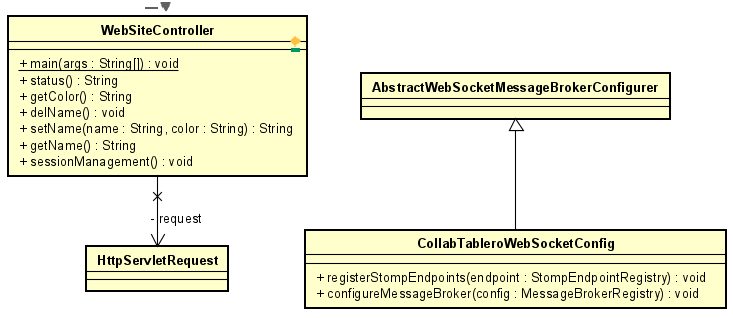

# Titulo

Tablero Interactivo

## Descripción

En este repositorio se encontrará un programa que al iniciar una sesión podrá ingresar a un tablero colaborativo en tiempo real, en el cual, podrá dibujar al tiempo con otras personas y borrar el contenido del mismo.

Para ver la implementación en Heroku dirijase [aquí](https://tablero-interactivo.herokuapp.com/)

### LOC/h

Para este taller se hicieron 418 líneas de código, en 12 horas.

**34.8 LOC/h**

### Prerrequisitos

Para correr este se debe tener instalado:

- Maven
- Java

### Guía de uso

Para compilar el proyecto se debe usar:

```
mvn package
```

Para ejecutarlo, se debe hacer de la siguiente forma

```
$ mvn spring-boot:run
```

Una vez ejecute este comando podrá ingresar al servidor web desde su navegador con la siguiente ruta http://localhost:5000, en esta encontrará una página HTML en la cual podrá ingresar con un nombre y un color para usar en el tablero proximamente.

## Documentación

Para visualizar la documentación se debe ejecutar el siguiente comando:

```
mvn javadoc:javadoc
```

Una vez se realice este comando, se debe buscar en la siguiente ruta "target\site\apidocs\index.html"

## Estructura de Archivos

    .
    |____pom.xml
    |____src
    | |____main
    | | |____java
    | | | |____co
    | | | | |____edu
    | | | | | |____escuelaing
    | | | | | | |____CollabTableroWebSocketConfig.java
    | | | | | | |____WebSiteController.java
    | |____resources
    | | |____static
    | | | |____js
    | | | | |____FirstComponent.js
    | | | | |____index.js
    | | | | |____sketch.js
    | | | |____css
    | | | | |____style.css
    | | | |____status.html
    | | | |____index.html
    | | | |____tablero.html
    | |____test
    | | |____java
    | | | |____co
    | | | | |____edu
    | | | | | |____escuelaing

## Diagrama de Clases



## Construido con

- [Maven](https://maven.apache.org/) - Dependency Management
- [Java](https://www.java.com/es/) - Progamming Language

## Autor

- **Juan Carlos Baez Lizarazo** - [juanbaezl](https://github.com/juanbaezl)

## Fecha

25 de Junio, 2022

## Licencia

Para más información ver: [LICENSE.txt](License.txt)
